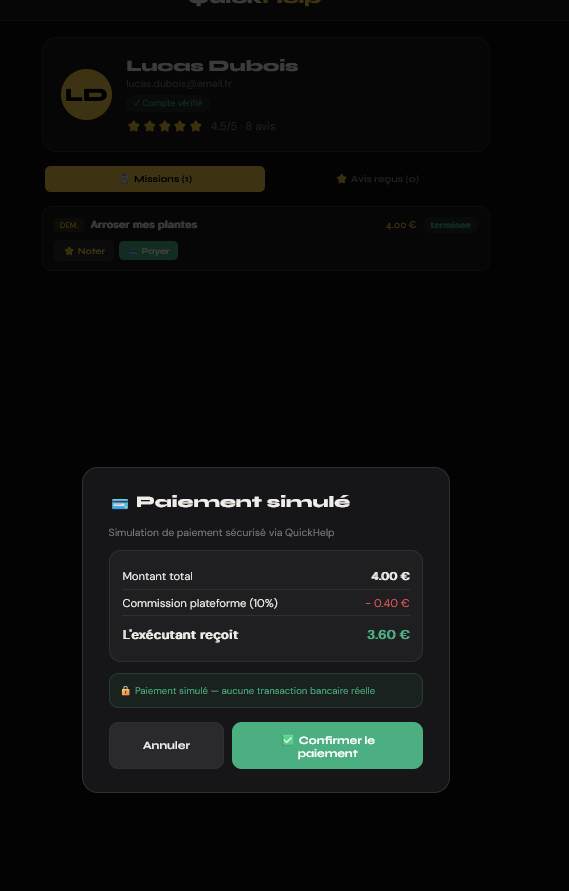
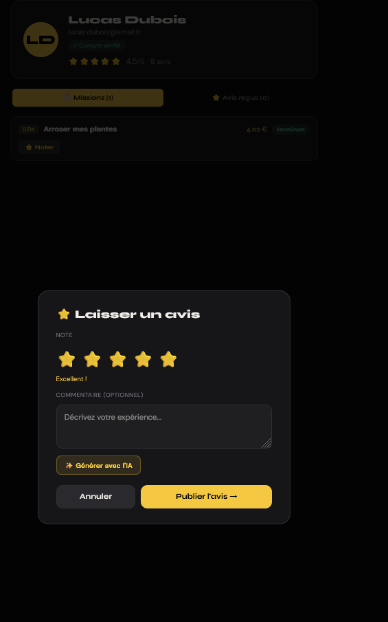

# QuickHelp

Application web de micro-taches locales developpee dans le cadre du projet P2IP a l'ESILV.

QuickHelp met en relation des personnes ayant besoin d'aide pour des petites missions du quotidien avec des utilisateurs disponibles a proximite.

Technologies : FastAPI - Python - MySQL - JavaScript - Leaflet - OpenStreetMap

---

## Presentation

QuickHelp est une application web locale d'entraide entre particuliers. Elle permet de publier, consulter, accepter et suivre des micro-missions autour de soi.

Exemples de missions :

- Porter des courses
- Arroser des plantes
- Aide aux devoirs
- Petite assistance informatique
- Services ponctuels du quotidien

L'objectif est de proposer une solution simple, rapide et locale pour faciliter l'entraide entre particuliers.

---

## Fonctionnalites

### Utilisateurs

- Creation de compte
- Connexion avec mot de passe chiffre
- Gestion du profil
- Mise a jour de la position
- Historique des missions
- Notes et avis

### Missions

- Publication d'une mission
- Description detaillee
- Definition du prix
- Geolocalisation de la mission
- Consultation des missions disponibles autour de soi
- Acceptation, demarrage et finalisation d'une mission

### Carte interactive

- Affichage des missions sur une carte
- Geolocalisation des utilisateurs
- Distance estimee entre l'utilisateur et les missions
- Integration cartographique avec Leaflet et OpenStreetMap

### Paiement simule

- Creation automatique d'une transaction
- Simulation de validation de paiement
- Calcul automatique de la commission plateforme
- Portefeuille virtuel utilisateur

### Avis

- Notation de 1 a 5 etoiles
- Commentaires utilisateurs
- Calcul automatique de la moyenne des evaluations

### Administration

- Tableau de bord administrateur
- Statistiques globales
- Suivi des utilisateurs
- Suivi des missions
- Visualisation des transactions

### Assistance IA

- Generation assistee de descriptions de missions
- Generation assistee d'avis
- Fallback local par templates si aucune cle API n'est fournie

---

## Technologies utilisees

### Backend

- Python
- FastAPI
- Uvicorn
- MySQL Connector
- bcrypt

### Base de donnees

- MySQL

### Frontend

- HTML
- CSS
- JavaScript

### Cartographie

- Leaflet
- OpenStreetMap
- OSRM

---

## Architecture du projet

```text
QuickHelp/
├── main.py
├── index.html
├── quickhelp_database.sql
├── README.md
└── app/
    ├── core/
    │   ├── config.py
    │   ├── database.py
    │   └── security.py
    ├── routers/
    │   ├── admin.py
    │   ├── ai.py
    │   ├── auth.py
    │   ├── categories.py
    │   ├── notifications.py
    │   ├── reviews.py
    │   ├── tasks.py
    │   └── users.py
    ├── schemas/
    │   ├── ai.py
    │   ├── auth.py
    │   ├── reviews.py
    │   ├── tasks.py
    │   └── users.py
    ├── services/
    │   ├── admin_service.py
    │   ├── ai_service.py
    │   ├── auth_service.py
    │   ├── category_service.py
    │   ├── notification_service.py
    │   ├── profile_service.py
    │   ├── review_service.py
    │   ├── seed_service.py
    │   ├── task_service.py
    │   └── user_service.py
    └── utils/
        ├── geo.py
        └── serializers.py
```

### Principe d'organisation

```text
Utilisateur
    ↓
Interface Web HTML / CSS / JavaScript
    ↓
Routes FastAPI
    ↓
Services metier
    ↓
Base de donnees MySQL
```

---

## Apercu du prototype

Cette section permet de comprendre rapidement les principaux parcours de QuickHelp sans lancer l'application.

### Carte interactive des missions


La page principale affiche les missions disponibles sur une carte OpenStreetMap. L'utilisateur peut filtrer par rayon, visualiser les marqueurs de missions, consulter la distance estimee et ouvrir une fiche detaillee avec le prix, la categorie, le demandeur et le gain net estime.

### Creation d'une mission


Le formulaire de creation permet de publier une nouvelle micro-tache avec une categorie, un titre, une description, un prix et une duree estimee. La position GPS de l'utilisateur est utilisee pour localiser automatiquement la mission. Une option d'assistance IA peut aider a generer une description.

### Paiement simule



QuickHelp integre un paiement simule pour representer le fonctionnement economique de la plateforme. La modale detaille le montant total, la commission de 10 % et le montant net recu par l'executant. Aucune transaction bancaire reelle n'est effectuee dans ce prototype.

### Systeme d'avis



Apres une mission terminee, un utilisateur peut laisser une note de 1 a 5 etoiles et ajouter un commentaire. Ces avis alimentent ensuite la note moyenne du profil utilisateur et renforcent la confiance entre les membres.

### Tableau de bord administrateur


L'interface administrateur centralise les indicateurs importants du prototype : nombre d'utilisateurs, missions publiees, missions disponibles, missions terminees, volume simule, commissions, avis et transactions. Elle sert a superviser l'activite globale de la plateforme.

---

## Installation

### 1. Cloner le projet

```bash
git clone https://github.com/Cpempelew/quickhelp-local-microtasks.git
cd quickhelp-local-microtasks
```

### 2. Creer un environnement virtuel

```bash
python -m venv .venv
```

Sur Windows :

```bash
.venv\Scripts\activate
```

Sur macOS / Linux :

```bash
source .venv/bin/activate
```

### 3. Installer les dependances

```bash
pip install fastapi uvicorn mysql-connector-python bcrypt
```

### 4. Creer la base de donnees

Importer le fichier SQL dans MySQL :

```sql
quickhelp_database.sql
```

Exemple avec le terminal MySQL :

```bash
mysql -u root -p < quickhelp_database.sql
```

### 5. Configurer la connexion MySQL

La configuration se trouve dans :

```text
app/core/config.py
```

Par defaut, l'application utilise :

```python
DB_CONFIG = {
    "host": "localhost",
    "port": 3306,
    "user": "root",
    "password": "YOUR_MYSQL_PASSWORD",
    "database": "quickhelp",
}
```

Il est aussi possible de configurer la base avec des variables d'environnement :

```bash
QUICKHELP_DB_HOST=localhost
QUICKHELP_DB_PORT=3306
QUICKHELP_DB_USER=root
QUICKHELP_DB_PASSWORD=your_password
QUICKHELP_DB_NAME=quickhelp
```

Variables d'environnement administrateur :

```bash
QUICKHELP_ADMIN_EMAIL=admin@quickhelp.demo
QUICKHELP_ADMIN_PASSWORD=CHANGE_ME
```

### 6. Lancer l'application

```bash
python main.py
```

Ou avec Uvicorn :

```bash
uvicorn main:app --reload
```

### 7. Ouvrir l'application

```text
http://localhost:8000
```

---

## Donnees de demonstration

Au demarrage, l'application ajoute automatiquement des donnees de demonstration si les tables sont vides :

- Categories de missions
- Utilisateurs de test
- Missions de test
- Compte administrateur

Mot de passe des utilisateurs de demonstration :

```text
password123
```

---

## API principale

### Authentification

```text
POST /auth/register
POST /auth/login
```

### Missions

```text
GET  /taches
POST /taches
PUT  /taches/{task_id}/accepter
PUT  /taches/{task_id}/demarrer
PUT  /taches/{task_id}/terminer
PUT  /taches/{task_id}/payer
```

### Utilisateurs

```text
GET /utilisateurs/{user_id}
PUT /utilisateurs/{user_id}/position
GET /utilisateurs/{user_id}/avis
GET /utilisateurs/{user_id}/wallet
```

### Avis, categories et notifications

```text
POST /avis
GET  /categories
GET  /notifications/{user_id}
```

### Administration

```text
GET /admin/stats
GET /admin/missions
GET /admin/utilisateurs
GET /admin/transactions
```

### IA

```text
POST /api/suggest
```

---

## Equipe

Projet realise dans le cadre du P2IP ESILV.

Equipe 3141 :

- Adam B.
- Candice A.
- Mohamed A.
- Salmen B.
- Kerry A.
- Ilyas K.

---

## Competences developpees

Au travers de ce projet, nous avons travaille sur :

- Developpement Full-Stack
- Conception de bases de donnees
- APIs REST
- Cartographie interactive
- Gestion de projet agile
- Travail collaboratif avec GitHub
- Experience utilisateur
- Refactorisation d'une API FastAPI en architecture modulaire

---

## Perspectives d'amelioration

Les evolutions envisagees comprennent :

- Authentification JWT complete
- Paiement bancaire reel securise
- Application mobile Android / iOS
- Notifications en temps reel
- Messagerie integree
- Verification avancee des profils
- Deploiement Cloud
- Recommandation intelligente de missions

---

## Contexte academique

Projet realise dans le cadre du module P2IP, Projet Pluridisciplinaire d'Innovation et de Programmation, a l'ESILV.

Le projet a ete concu, developpe et presente lors du showroom de fin d'annee.
